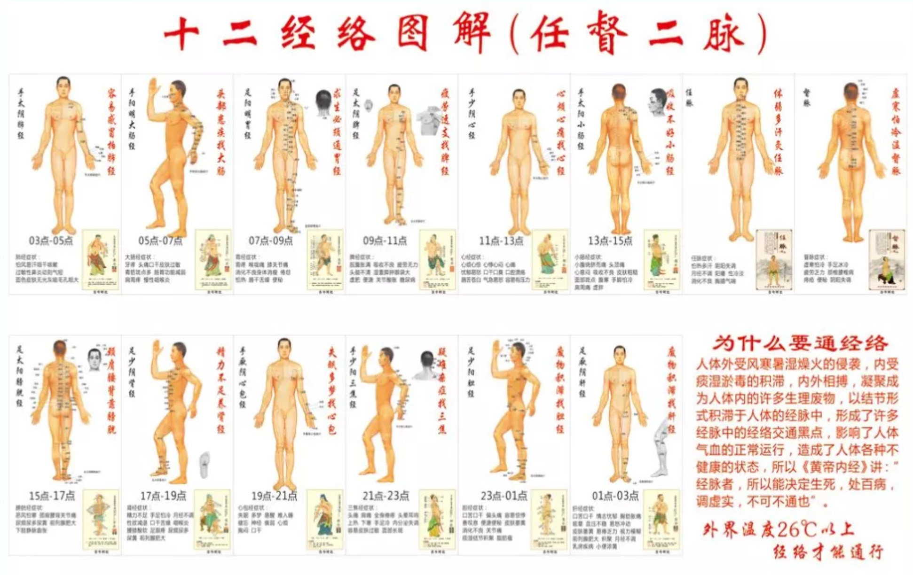
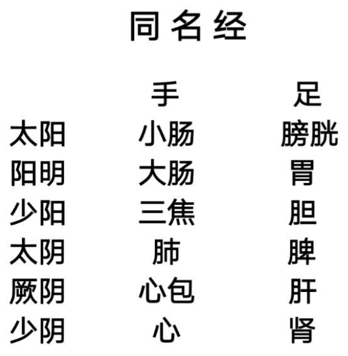

# 掌握一个原则，人人都可应用经络调理身体

## 一、 什么是经络处方

身体健康一旦出问题，很多人会疑心，是不是某种营养不够用啦？担心身体不去工作。其实这都是我们自己的想象。

**身体是智能的**，只要我们不去过多干扰它，遵循天地规律的情况，它的运行、自我调节就会在最佳状态上。

**为什么疏通经络有利于恢复健康呢**？

原因在于，经络是脏腑的延伸，它本身不治病，但它的畅通是必须的。经络畅通意味着气血正常的运行，可以投射出脏腑的功能正常。疏通十二经络的易堵塞穴位，保持十二脏腑功能正常，就能恢复身体的智能。

**经络处方，就是针对具体疾患采用经络疏理、艾灸、刮痧、拔罐的综合协同调理方案，达到经络畅通，气血循行正常，身体阴阳平衡的状态**。即使是非中医专业人士，也能按照处方直接执行。

那么经络处方应该如何去制定呢？主要有以下几个原则：

- 经脉所过，主治所及；
- 五行理论；
- 气机升降。
  
## 二、 经络处方制定的第一大原则：经脉所过，主治所及

### 2.1 经络循行线路

我一直强调一个观点：**经络是中国人的人体解剖学**。

十二条经络的循行线路都是有规律的，在某个位置出现的问题，可以按揉相应经络的易堵塞穴位。

以脾经为例，从循行线路上，我们可以简单了解到，以下疾病都与脾经有关：

- 有的人痛风，发作的区域多数在大脚趾和脚掌相连接的关节处；
- 劳累过度后的咽喉肿痛，嗓子哑了；
- 劳累过度后的心慌、胸闷、气短……

身体上某个位置发生的问题，到经络图去寻找，有时会让我们豁然开朗，比如：

- **静脉曲张**，有的人发生在小腿外侧，这是胆经的线路；有的人在小腿内侧，那是脾经的线路。
- **头痛**，要分四个位置：偏头痛是三焦经、胆经线路；前额头痛、眉毛上方区域是胃经线路；巅顶疼痛在肝经线路上；后头痛是膀胱经线路。
- **乳腺增生**，胃经就走在乳腺上，心包经的第一个穴位在乳头旁开一寸，肝经最后一个穴位在乳房下缘，所以调理乳腺增生，重点在于疏通这三条经络。

建议大家买一套**十二经络图**，挂在家里的墙上。平时仔细观察每条经络在肢体、在胸腹腔的循行线路。慢慢地积累，就会养成系统看身体的习惯，遇到问题，也能更有的放矢了。

### 2.2 脏腑功能异常

我们也可以根据疾病出现的具体脏器，直接疏通对应经络的易堵塞穴位来调理。

比如心脏病，肯定要疏通心经、心包经；肾结石，首先要疏通肾经……

通过经络循行线路和脏腑异常，我们可以首先确定从哪个脏腑开始调理。不过别忘记，**人体是整体，任何一个脏器都与多个脏器有关联**，下面来看脏腑关联的规律。

### 2.3 脏腑表里关系

中医将人体分为十二个脏器，这十二个脏器又分为两类：六脏与六腑。

六脏是肝、心、脾、肺、肾、心包；六腑是大肠、小肠、膀胱、三焦、胆、胃。六脏与六腑相配，共六对，六脏在里，六腑在表，形成**表里关系**。

|脏（里）|肝|心|脾|肺|肾|心包|
|----|----|----|----|----|----|----|
|腑（表）|胆|小肠|胃|大肠|膀胱|三焦|

要记住表里关系，有一个口诀：**肺大胃脾心小肠，膀肾包焦胆肝详**。

口诀第一层含义：**表示相邻脏器为表里关系**。比如「肺大」指肺和大肠是表里关系，以此类推，胃与脾、心和小肠、膀胱和肾、心包和三焦、肝和胆是表里关系。

遇到病痛，如果确定了是某一脏腑的问题，在疏通相应经络的同时，还要按揉表里经的易堵塞穴位，这样我们就把一个「局部」问题，延伸出去了。

这个口诀还有第二层含义：**包含子午流注的时间次序**。

病痛发作的时间规律就在这张图里。某一个病痛，连续三天在同一时间段发作，就可以按揉疏通对应经络的易堵塞穴位，常常立竿见影，这都是祖先给我们留下来的宝贝呀！

### 2.4 同名经

表里关系是通过五行的属性将十二脏腑分成六组，「同名经」则是用另外一种形式将十二脏腑分成六组。

什么是同名经？

中国文化的起源——《易经》告诉我们宇宙的奥秘是从无到有，无极生太极，太极生两仪，两仪就是阴和阳。

更具体的，**《易经》把阳分太阳和少阳，阴分太阴和少阴；另外，在阳里加了一个阳明，阴里加了一个厥阴，统称为「六气」**。

我们身体有十二脏腑，六气配我们身体，需要分手足，六乘以二，刚好是十二，分别这样对应：

以上每一对都是同名经，它们在功能上有**必然的联系**。

### 2.5 阴阳开阖

中医将阴阳分成了六份：太阳、少阳、阳明、太阴、少阴、厥阴。《黄帝内经·阴阳离合论》里说：太阳为开，阳明为合，少阳为枢；太阴为开，厥阴为合，少阴为枢。

什么意思呢？

早晨醒来的时候，我们可以做一个实验：坐在床上，两腿并拢放平，把头向膝盖方向靠，好像很难够到膝盖，这是因为整个脊柱全是僵硬的，经过一夜的休息，身体所有的关节都是紧的，都是收敛状态。

而同样的动作到了下午三点钟左右再做一次，会发现比早晨更容易接近膝盖了，因为经过一上午，身体舒展了。

早上，我们身体里面舒展的能力需要慢慢地恢复。阳气的释放是谁来主导呢？古人观察到，是由**太阳**来主导的，包括手太阳小肠和足太阳膀胱。到了黄昏时分，我们身体里阳气的收敛也要有一个东西来主导，由**阳明**来负责。而阳门的开合还需要有一个门轴，这由**少阳**来负责。

同样的道理，黄昏时分，阳气要收敛，阴气要释放，阴气在释放的过程中，也要有一个主导的力量。古人说，**太阴**就是阴门打开的主导，所以太阴为开；到了黎明时分，阳气要出来了，阴气要收回来了，**厥阴**就是阴门关闭的主导；而**少阴**就是阴门开合所需要的门轴。

如果把阳的释放和阴的释放归为一组，用手足来配对，就是以下的结果。

怎样来理解？

- 比如，小肠是人体最重要的消化器官，所有的食物进来之后都要在小肠转化成能量，而消化的主导是脾，所以**脾和小肠是一对**。
- 再比如，直肠癌患者手术之后，多数患者会伴有肝转移。用现代医学的解剖认知很难解释，为什么肠道的问题会向肝转移？古人则告诉我们：**大肠与肝有关联**。

当我们仔细研究这些分组方式时，你会不知不觉地感到，我们的祖先真是太了不起了！**圣人们一直在山顶等着我们，而我们还在山脚下逡巡不前，更有「不肖子孙」认为祖宗的东西一无是处**。

掌握了上述三种分组方式后，遇到一个脏腑问题，你会知道，它最起码和三个脏器是有关联的。

## 三、 经络处方制定的第二大原则：五行的相生相克关系

古人将万事万物分成了五类：木，火，土，金，水。中国人认为宇宙万事万物都是整体关联、动态平衡的。一部车拆开了装上还能跑；但宇宙拆开了就崩塌了；一个人，如果把它拆开了，这个人体也就不复存在了。

那么动态平衡如何来维系呢？

它有一个「相互帮忙」的关系，就是五行的相生：**木生火，火生土，土生金，金生水，水生木**。除了相生，五行也有相克：**木克土，火克金，土克水，金克木，水克火**。

为什么要按木，火，土，金，水这个次序来记呢？看图我们会发现，相邻相生，相隔相克。

**木、火、土、金、水分别对应肝、心、脾、肺、肾**。

掌握了五行生克关系，我们在「经脉所过，主治所及」的基础上，可以进一步地把调理思路丰富和立体起来。

**以肝病为例**：

- 首先，要疏通肝经；
- 其次，按表里关系，要疏通胆经；
- 第三，肝经的同名经是心包经；
- 第四，阴阳的开合对应的是大肠经；
- 第五，相生关系，水生木，对应肾经；
- 第六，相克关系，金克木，对应肺经。

按这个原则，我们发现，**一个脏器的问题会和另外五个脏器有关联**。

常有朋友在微信群里问我一些具体病痛，我总说重点在于疏通哪几条经络，并需要坚持一个星期。后面都会加一句：**最终十二经络都应该畅通，因为身体是一个整体**。

## 四、 经络处方制定的第三大原则：气机升降

有的朋友说：我有高血压、高血脂、糖尿病、便秘、失眠、倦怠乏力……十二个脏器好像都出现了问题，应该怎么办呢？我会告诉他：**那就先恢复身体的气机升降**。

什么叫气机？**一升一降就是气机**。春天主升发，秋天主降，中间的是脾土，我们疏通肝经、肺经、脾经堵塞穴位，就能促进肝、肺、脾的功能，恢复身体的一气周流。

就好像老式的座钟，指针不动了，上好发条还是不动，这时如果轻轻动一下钟摆，指针可能就走了起来。身体同样如此，只要有一个微微的刺激就好，身体会慢慢去调整。

尤其针对有多种疾病的老年人，我都建议**先疏通肝经、脾经和肺经堵塞穴位**，让身体的生机重现。

## 五、 肩膀疼痛调理案例分享

最后分享一则最近调理的案例，这位朋友在调理后还专门写了一篇文章记录。

作者肩膀疼痛一个月，尝试了针灸、汤药、刮痧、拔罐，效果都不理想。
我当时看他肩膀痛的位置在肩胛骨，正是**小肠经**的线路，但是揉小肠经的易堵塞穴位，他却没感觉。

于是我想到了**表里关系**，就点了他**心经**的易堵塞穴位，少海穴和腕部四穴。结果少海穴剧痛，揉了一会儿，痛感减轻，腕部四穴痛感也减轻。他表示肩膀疼痛当场好了50%。

然后他来精神了，说赶紧吃饭去。到了餐厅，我去洗手间，洗手的时候就想到了还有**同名经**啊：手太阳小肠经对应足太阳膀胱经。于是回来后，我就给他捏了**膀胱经**的承山穴，在小腿中段一掐，感觉很硬，他也直喊疼。揉了一会承山穴，痛感减轻，他马上觉得好了80%。

吃完饭回去，送我到酒店后，他开心地走了。我突然又想到，还有一个阴阳开阖、五脏旁通，手太阳小肠经对足太阴脾经。

第二天我见到他问：你好了多少啦？他说好了80%。我问他，知道为什么吗？他说不知道。我说，因为我还留了一手。其实也不是「留了一手」，是当时我没有想起来。我给他点了**脾经**的易堵塞穴位阴陵泉穴和地机穴，他肩关节的疼痛就彻底好了。

他后来就在文章中说到：**路老师当天晚上点了三个穴位，肩膀疼痛就好了大半**。

有朋友在下面评论问：您点的是哪三个穴位？

其实这不可能有统一的答案，我也没办法回复。而今天讲过了经络处方的原则再去说是哪几个穴位，大家自然会明白。

我们只要通过经络给我们的信息，去判定身体有什么异样，然后再根据今天所讲的经络处方原则，给身体进行调整，就可以很方便地为自己和身边的朋友和家人解除或缓解病痛。

希望更多朋友实践起来，让祖先的智慧借助中医之光惠及更多生命！
