# 十二经络肌表内脏联系图

## 一、 肺经循行线路

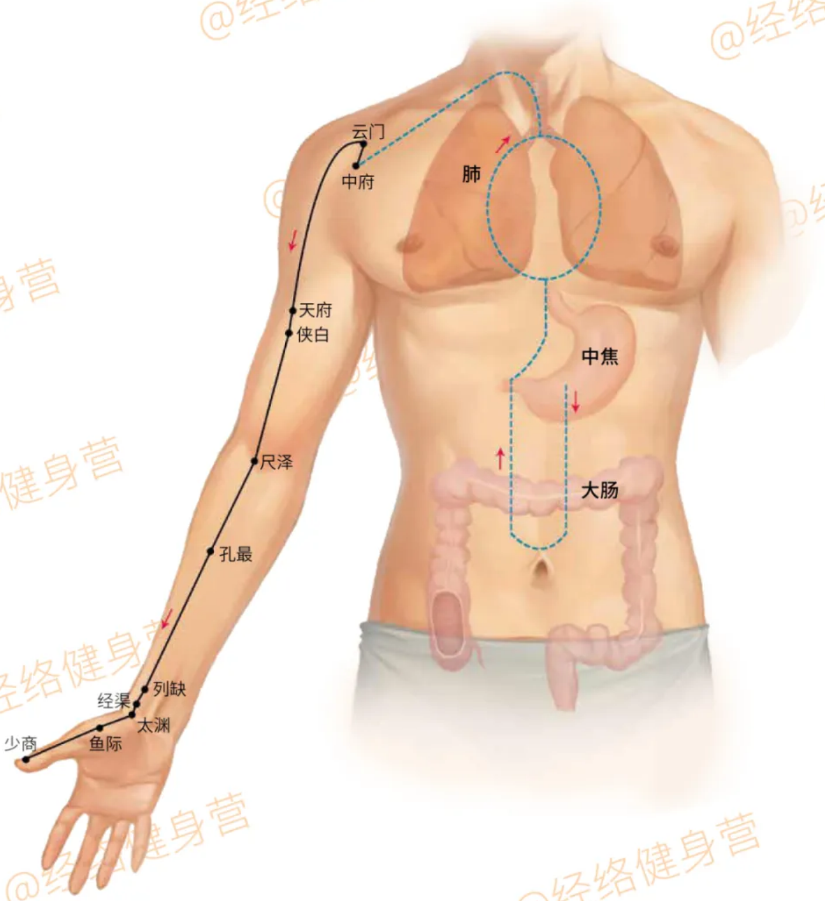

《黄帝内经》：「肺手太阴之脉，起于中焦，下络大肠，还循胃口，上膈属肺，从肺系横出腋下，下循臑内，行少阴心主之前，下肘中，循臂内上骨下廉，入寸口，上鱼，循鱼际，出大指之端；其支者：从腕后直出次指内廉，出其端。」

第1页，共12页

## 二、 大肠经循行线路

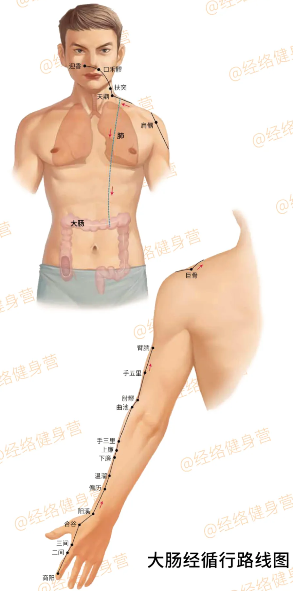

《黄帝内经》：「大肠手阳明之脉，起于大指次指之端，循指上廉，出合谷两骨之间，上入两筋之中，循臂上廉，入肘外廉，上臑外前廉，上肩，出髃骨之前廉，上出于柱骨之会上，下入缺盆，络肺，下膈，属大肠。其支者：从缺盆上颈贯颊，入下齿中，还出挟口，交人中，左之右，右之左，上挟鼻孔。」

第2页，共12页

## 三、 胃经循行线路

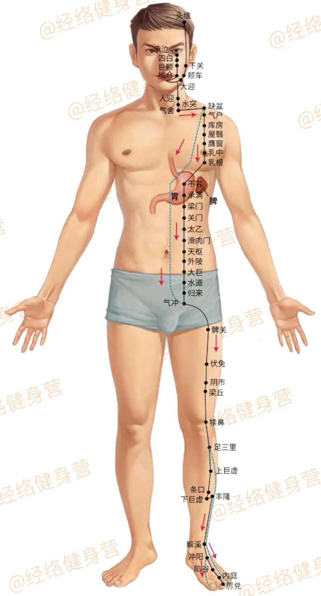

《黄帝内经》：「胃足阳明之脉，起于鼻之交頞中，旁纳太阳之脉，下循鼻外，入上齿中，还出挟口，环唇，下交承浆，却循颐后下廉，出大迎，循颊车，上耳前，过客主人，循发际，至额颅。其支者：从大迎前下人迎，循喉咙，入缺盆，下膈，属胃，络脾。其直者：从缺盆下乳内廉，下挟脐，入气街中。其支者：起于胃口，下循腹里，下至气街中而合，以下髀关，抵伏兔，下膝膑中，下循胫外廉，下足跗，入中指内间。其支者：下廉三寸而别，下入中指外间。其支者：别跗上，入大指间，出其端。」

第3页，共12页

## 四、 脾经循行线路

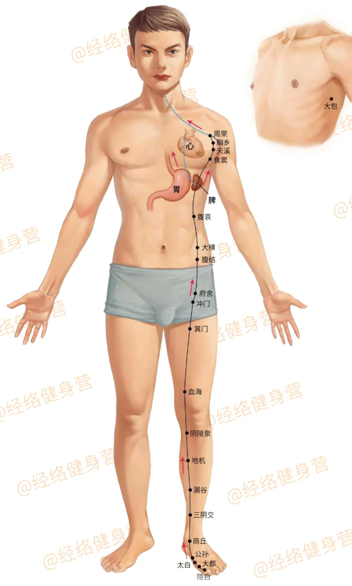

《黄帝内经》：「脾足太阴之脉，起于大指之端，循指内侧白肉际，过核骨后，上内踝前廉，上腨内，循胫骨后，交出厥阴之前，上膝股内前廉，入腹，属脾，络胃，上膈，挟咽，连舌本 ，散舌下。其支者：复从胃，别上膈，注心中。」

第4页，共12页

## 五、 心经循行线路

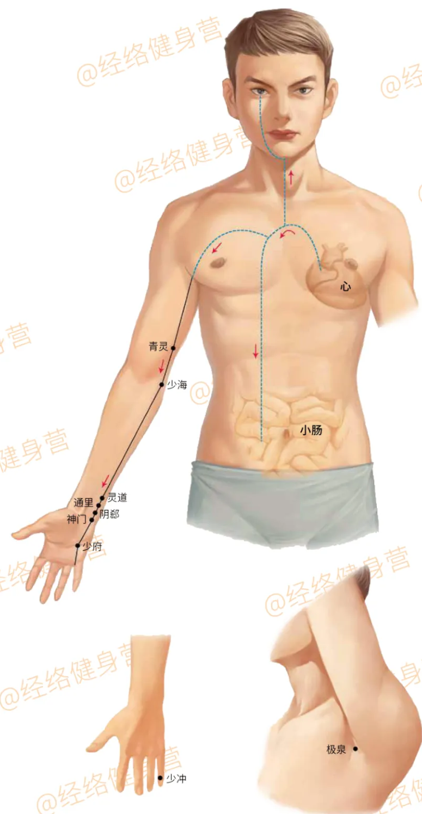

《黄帝内经》：「心手少阴之脉，起于心中，出属心系，下膈络小肠。其支者：从心系上挟咽，系目系。其直者：复从心系却上肺，下出腋下，下循臑内后廉，行太阴心主之后，下肘内，循臂内后廉，抵掌后锐骨之端，入掌内后廉，循小指之内出其端。」

第5页，共12页

## 六、 小肠经循行线路

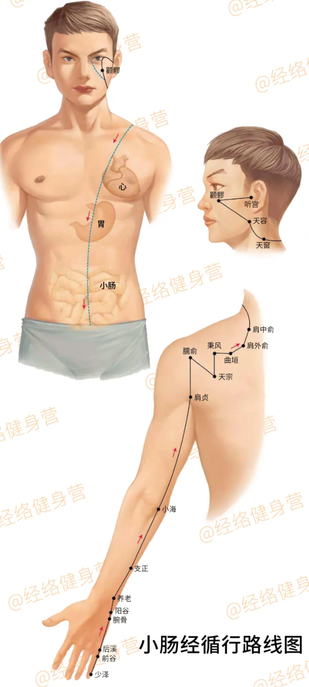

《黄帝内经》：「小肠手太阳之脉，起于小指之端，循手外侧，上腕，出踝中，直上循臂骨下廉，出肘内侧两筋之间，上循臑外后廉。出肩解，绕肩胛，交肩上，入缺盆，络心，循咽，下膈，抵胃，属小肠。其支者：从缺盆循颈上颊，至目锐眦，却入耳中。其支者：别颊上䪼，抵鼻，至目内眦，斜络于颧。」

第6页，共12页

## 七、 膀胱经循行线路

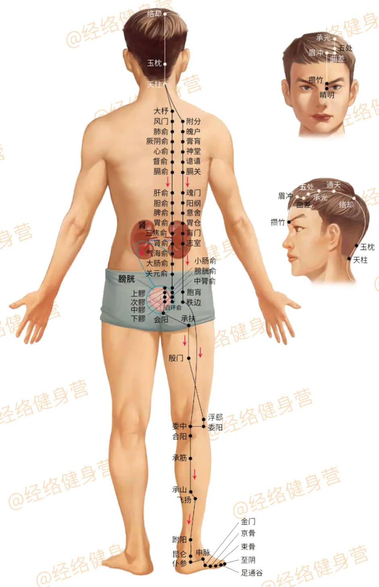

《黄帝内经》：「膀胱足太阳之脉，起于目内眦，上额，交巅。其支者：从巅至耳上角。其直者：从巅入络脑，还出别下项 ，循肩髆内，挟脊抵腰中，入循膂，络肾，属膀胱。其支者：从腰中，下挟脊，贯臀，入腘中。其支者：从髆内左右别下贯胛，夹脊内，过髀枢，循髀外后廉下合腘中，以下贯腨内，出外踝之后，循京骨至小趾外侧。」

第7页，共12页

## 八、 肾经循行线路

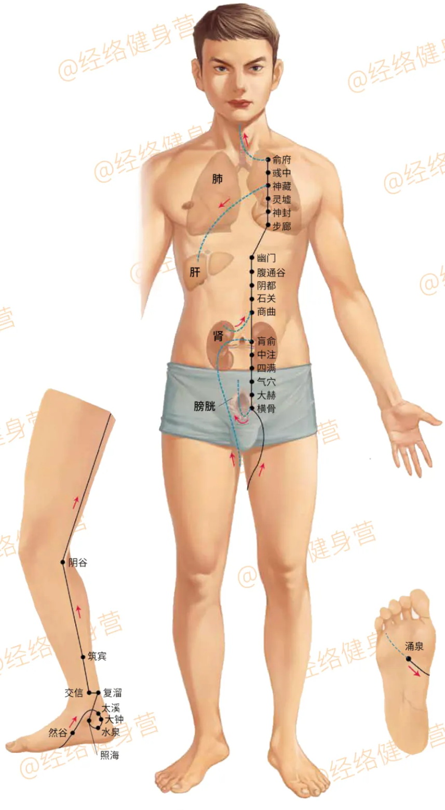

《黄帝内经》：「肾足少阴之脉，起于小指之下，邪走足心，出于然谷之下，循内踝之后，别入跟中，以上腨内，出腘内廉， 上股内后廉， 贯脊属肾，络膀胱。其直者：从肾上贯肝膈，入肺中，循喉咙，挟舌本。其支者：从肺出络心，注胸中。」

第8页，共12页

## 九、 心包经循行线路

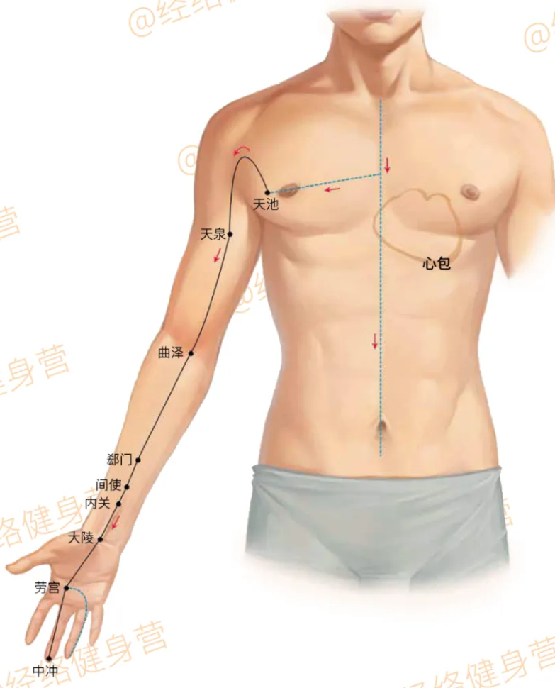

《黄帝内经》：「心主手厥阴心包络之脉，起于胸中，出属心包络，下膈，历络三焦。其支者：循胸出胁，下腋三寸，上抵腋下，循臑内，行太阴少阴之间，入肘中，下臂行两筋之间，入掌中，循中指出其端。其支者：别掌中，循小指次指出其端。」

第9页，共12页

## 十、 三焦经循行线路

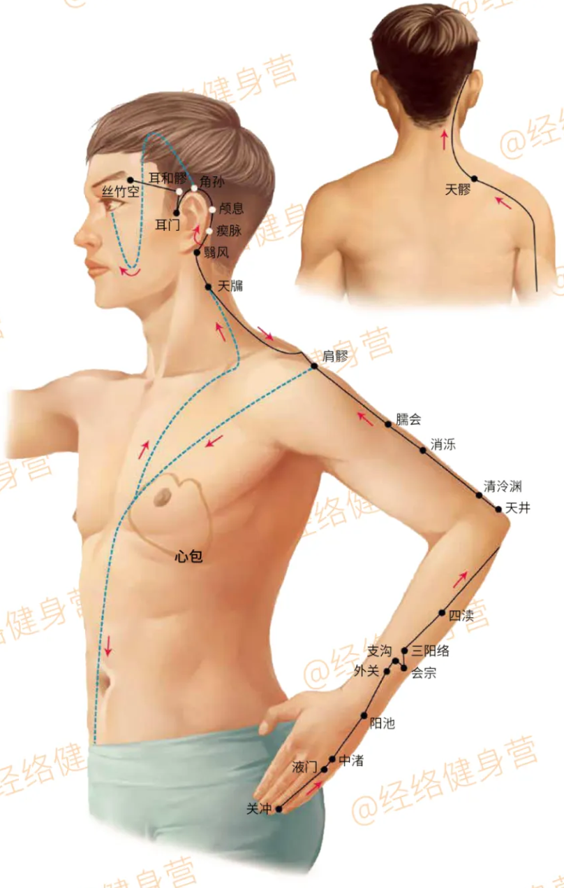

《黄帝内经》：「三焦手少阳之脉，起于小指次指之端，上出两指之间，循手表腕，出臂外两骨之间，上贯肘，循臑外上肩，而交出足少阳之后，入缺盆，布膻中，散落心包，下膈，循属三焦。其支者：从膻中上出缺盆，上项，系耳后，直上出耳上角，以屈下颊至䪼。其支者：从耳后入耳中，出走耳前，过客主人前，交颊，至目锐眦。」

第10页，共12页

## 十一、 胆经循行线路

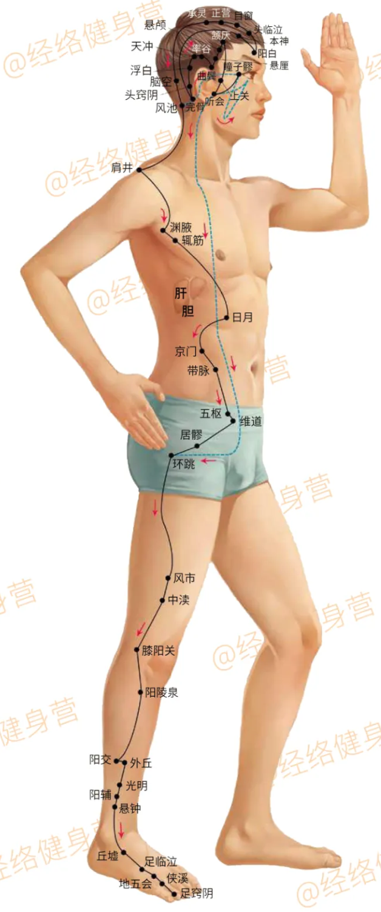

《黄帝内经》：「胆足少阳之脉，起于目锐眦，上抵头角，下耳后，循颈，行手少阳之前，至肩上，却交出手少阳之后，入缺盆。其支者：从耳后入耳中，出走耳前，至目锐眦后。其支者：别锐眦，下大迎，合于手少阳，抵于䪼，下加颊车，下颈，合缺盆。以下胸中，贯膈，络肝，属胆，循胁里，出气街，绕毛际，横入髀厌中。其直者：从缺盆下腋，循胸，过季胁，下合髀厌中。以下循髀阳，出膝外廉，下外辅骨之前，直下抵绝骨之端，下出外踝之前，循足跗上，入小指次指之间。其支者：别跗上，入大指之间，循大指歧骨内，出其端，还贯爪甲，出三毛。」

第11页，共12页

## 十二、 肝经循行线路

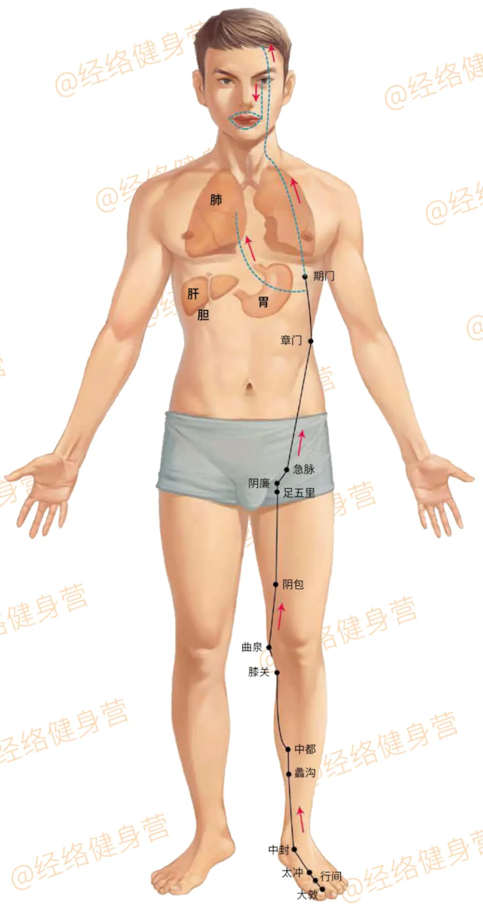

《黄帝内经》：「肝足厥阴之脉，起于大指丛毛之际，上循足跗上廉，去内踝一寸，上踝八寸，交出太阴之后，上腘内廉，循股阴，入毛中，环阴器，抵小腹，挟胃，属肝络胆，上贯膈，布胁肋，循喉咙之后，上入颃颡，连目系，上出额，与督脉会于巅。其支者：从目系下颊里，环唇内。其支者：复从肝别贯膈，上注肺。」

第12页，共12页
