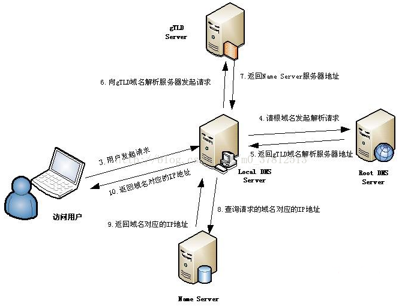

# DNS原理及软件开发中应用

## DNS定义

`DNS`，就是`Domain Name System`的缩写，即域名系统，是互联网上作为`域名`和`IP地址`相互映射的一个分布式数据库。DNS能够使用户更方便的访问互联网，而不用去记住能够被机器直接读取的IP地址串。通过域名，最终得到该域名对应的IP地址的过程叫做域名解析（或主机名解析）。

## 域名解析过程

下面这张图，详细说明了一个DNS域名解析的全过程：

网络客户端就是我们平常使用的电脑，打开浏览器，输入一个域名。比如输入www.163.com，这时，你使用的电脑会发出一个DNS请求到本地DNS服务器。本地DNS服务器一般都是你的网络接入服务器商提供，比如中国电信，中国移动。

查询www.163.com的DNS请求到达本地DNS服务器之后，本地DNS服务器会首先查询它的缓存记录，如果缓存中有此条记录，就可以直接返回结果。如果没有，本地DNS服务器还要向DNS根服务器进行查询。

根DNS服务器没有记录具体的域名和IP地址的对应关系，而是告诉本地DNS服务器，你可以到域服务器上去继续查询，并给出域服务器的地址。

本地DNS服务器继续向域服务器发出请求，在这个例子中，请求的对象是.com域服务器。.com域服务器收到请求之后，也不会直接返回域名和IP地址的对应关系，而是告诉本地DNS服务器，你的域名的解析服务器的地址。

最后，本地DNS服务器向域名的解析服务器发出请求，这时就能收到一个域名和IP地址对应关系，本地DNS服务器不仅要把IP地址返回给用户电脑，还要把这个对应关系保存在缓存中，以备下次别的用户查询时，可以直接返回结果，加快网络访问。

类似的解析说明图还有：

对应的说明：

1. 浏览器先检查自身缓存中有没有被解析过的这个域名对应的ip地址，如果有，解析结束。同时域名被缓存的时间也可通过`TTL属性`来设置。

1. 如果浏览器缓存中没有（专业点叫还没命中），浏览器会检查操作系统缓存中有没有对应的已解析过的结果。而操作系统也有一个域名解析的过程。在windows中可通过c盘里一个叫`hosts`的文件来设置，如果你在这里指定了一个域名对应的ip地址，那浏览器会首先使用这个ip地址。hosts文件所在目录为`Windows\System32\drivers\etc`。但是这种操作系统级别的域名解析规程也被很多黑客利用，通过修改你的hosts文件里的内容把特定的域名解析到他指定的ip地址上，造成所谓的域名劫持。所以在windows7中将hosts文件设置成了readonly，防止被恶意篡改。

1. 如果至此还没有命中域名，才会真正的请求本地域名服务器（`LDNS`）来解析这个域名，这台服务器一般在你的城市的某个角落，距离你不会很远，并且这台服务器的性能都很好，一般都会缓存域名解析结果，大约80%的域名解析到这里就完成了。

1. 如果LDNS仍然没有命中，就直接跳到`Root Server`域名服务器请求解析。

1. 根域名服务器返回给`LDNS`一个所查询域的主域名服务器（`gTLD Server`，国际顶尖域名服务器，如.com .cn .org等）地址。

1. 此时`LDNS`再发送请求给上一步返回的`gTLD`。

1. 接受请求的`gTLD`查找并返回这个域名对应的Name Server的地址，这个Name Server就是网站注册的域名服务器。

1. Name Server根据映射关系表找到目标ip，返回给`LDNS`。

1. `LDNS`缓存这个域名和对应的ip。

1. `LDNS`把解析的结果返回给用户，用户根据TTL值缓存到本地系统缓存中，域名解析过程至此结束。

## TTL

在配置DNS解析的时候，有一个参数常常容易忽略，就是DNS解析的`TTL`参数，`Time To Live`。TTL这个参数告诉本地DNS服务器，域名缓存的最长时间。用阿里云解析来举例，阿里云解析默认的TTL是10分钟，10分钟的含义是，本地DNS服务器对于域名的缓存时间是10分钟，10分钟之后，本地DNS服务器就会删除这条记录，删除之后，如果有用户访问这个域名，就要重复一遍上述复杂的流程。

其实，如果网站已经进入稳定发展的状态，不会轻易更换IP地址，我们完全可以将TTL设置到协议最大值，即24小时。带来的好处是，让域名解析记录能够更长时间的存放在本地DNS服务器中，以加快所有用户的访问。

## 软件开发中的应用

以本次建立的分中心、总中心两级系统为目标，考虑使用DNS，可以方便地调整分中心向总中心请求服务的IP地址。

分中心及总中心的DNS均为主备。只有总中心的DNS真正设置域名与IP的映射。分中心只负责缓存转发。

分中心DNS的`TTL`设置为`5到10分钟`比较好。这样，如果总中心修改了DNS，变化也可比较快地反映到分中心DNS。

总中心及分中心的服务，尽量不再直接配置IP地址，而是配置域名。各个部署服务的主机，也应设法设置TTL为`5至10分钟`。

## 参考

[dns缓存刷新时间是多久?dns本地缓存时间介绍](https://www.cnblogs.com/itfat/p/10622570.html)
