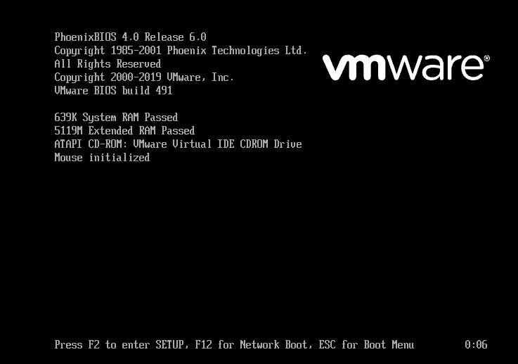

# VMware虚拟机进入BIOS方法
在VMware里面如何进入BIOS是个头疼的问题，因为启动界面一闪而过，即使你狂按`F2`（调整启动顺序）或`ESC`（进入BIOS Setup）键 ，绝大部分都无法进入BIOS。因为VMware启动界面显示时间太短、系统无法识别按键而直接开启了系统。

VMware的配置文件`.vmx`可以控制这个过程, 有两种参数可以设置来解决这个问题：

* 加入一行：`bios.forceSetupOnce = "TRUE"`，开机就自动进入BIOS!

 不过VMware启动后，会将该参数由TRUE变为FALSE。如果还要继续使用BIOS，就再手动改成TRUE即可。

*  延长启动画面时间：`bios.bootDelay = "10000"`，单位为毫秒。

启动后VMware不会自动修改该值，但在配置文件中的保存位置可能为变化。
