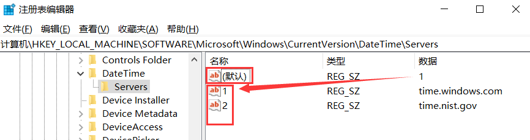

# 设置Windows对时服务

## 一、 指定对时服务器

需要指定当前主机所用的对时服务器，需在`命令行窗口`执行`regedit`打开`注册表编辑器`，定位到`HKEY_LOCAL_MACHINE\SOFTWARE\Microsoft\Windows\CurrentVersion\DateTime\Servers`，如下图：


* 名称为`默认`的项的值是当前系统使用的对时服务器的名称号。图中该值为`1`，因此系统使用`time.windows.com`作为默认对时服务器。
* 名称为数字的项的值是对时服务器名称，也可以是IP地址。
* 对时服务器可添加多个，只要名称为数字且不重复。

## 二、 本机作为对时服务器

将本机设置为对时服务器需执行以下操作：

1. 修改`HKEY_LOCAL_MACHINE\SYSTEM\CurrentControlSet\Services\W32Time\TimeProviders\NtpServer\Enabled`值为`1`。
1. 将`HKEY_LOCAL_MACHINE\SYSTEM\CurrentControlSet\Services\W32Time\Config\AnnounceFlags`默认值`10`改为`5`。`5`表示当前主机为可靠的时钟源。

## 三、 重启对时服务

要想以上操作生效，除重启系统外，也可以通过命令行重启服务：

```cmd
# 停止对时服务。
net stop w32time
# 启动对时服务。
net start w32time
```
